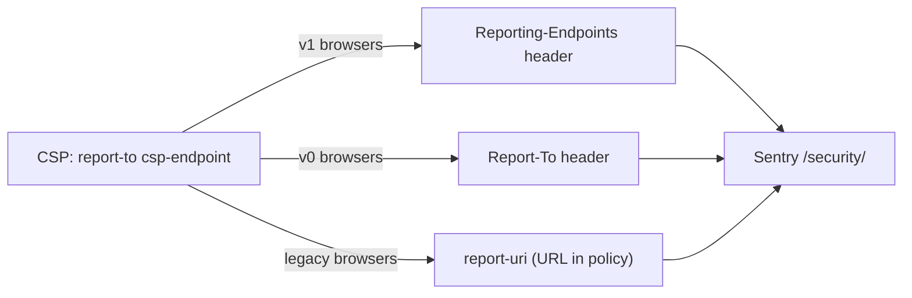

# CSP and Reporting Headers: Rationale and the Modern Approach

This document explains every HTML response header this repo emits around CSP,
why each one exists, which CSP directives are used and why, and what the
"modern minimal" setup looks like if you want to trim the header set.

Sources of truth in code:

| What | Where |
| --- | --- |
| CSP policy builder + Sentry reporting config | `packages/frontend/app/utils/csp.ts` |
| SSR runtime headers | `packages/frontend/app/ssr-handler.ts` (`applySsrResponseHeaders`) |
| SSG per-route headers (generated into `build/client/_headers`) | `vite-plugins/copy-headers.ts` (`buildStaticRouteHeaders`) |
| Base `_headers` templates | `headers/_headers.canary`, `headers/_headers.production` |

SSR and SSG emit the **same header set**; only the CSP source values differ
(SSR uses a per-request nonce, SSG uses build-time hashes of the actual inline
content).

---

## 1. Response headers and why each exists

| Header | Example / shape | Rationale |
| --- | --- | --- |
| `Content-Security-Policy` | `default-src 'self'; …; report-uri <sentry>; report-to csp-endpoint` | The **enforced** policy. It both blocks disallowed resources and, since it carries `report-uri` / `report-to`, reports those blocks to Sentry. A page without it has no protection. |
| `Report-To` | `{"endpoints":[{"url":"…"}],"group":"csp-endpoint","include_subdomains":true,"max_age":10886400}` | The **Reporting API v0** endpoint map. The CSP's `report-to csp-endpoint` directive is only a *name*; browsers that implement v0 resolve that name against this header to find the Sentry URL. |
| `Reporting-Endpoints` | `csp-endpoint="https://…"` | The **Reporting API v1** (modern) endpoint map. Same idea, newer spec. Browsers that implement v1 resolve `report-to csp-endpoint` against this header instead. |
| `Document-Policy` | `js-profiling` | Opts the document into the JS Self-Profiling API so Sentry's browser-profiling integration can run. Without it the browser logs a `[Violation] Document policy violation` and profiling silently fails. See `docs/csp-document-policy.md`. |

### Why there is no `Content-Security-Policy-Report-Only` anymore

Previously the repo sent a third header, `Content-Security-Policy-Report-Only`,
that mirrored the enforced policy and appended `report-uri` / `report-to`. That
was removed because:

- `Report-Only` never blocks anything; its only job is reporting. Since the
  enforced policy now carries the reporting directives itself, the mirror
  duplicated the same violation reports (or, before that change, existed purely
  as the only reporting channel).
- Both policies were **identical**, so `Report-Only` added no coverage —
  anything it reported was already blocked by the enforced policy.
- It doubled the largest header on every response (~2 KB of hashes sent twice).

Keep a `Report-Only` header only when trialing a **different, stricter**
policy before enforcing it. If the policies are identical, it is dead weight.

---

## 2. CSP directives — what each one is for

The policy is built by `csp.buildPolicy()` in `packages/frontend/app/utils/csp.ts`.
Emitted policy (SSR; SSG replaces the nonce with per-route hashes):

```text
default-src 'self'
base-uri 'self'
object-src 'none'
frame-ancestors 'none'
form-action 'self'
script-src 'self' https://static.cloudflareinsights.com https://*.posthog.com ['nonce-…' | 'sha384-…' …]
style-src-elem 'self' ['sha256-…' | 'sha384-…' …] ['nonce-…']
style-src-attr 'unsafe-inline'
font-src 'self'
img-src 'self' data:
frame-src 'self'
connect-src 'self' https://cloudflareinsights.com https://api.iconify.design https://*.posthog.com https://<sentry-ingest>
worker-src 'self' blob: data:
report-uri <sentry security endpoint>
report-to csp-endpoint
```

| Directive | Value | Why |
| --- | --- | --- |
| `default-src` | `'self'` | Fallback for anything not covered by a more specific directive. Same-origin only. |
| `base-uri` | `'self'` | Blocks `<base href>` injection attacks that could rewrite relative URLs. |
| `object-src` | `'none'` | Blocks `<object>` / `<embed>` (Flash-era plugins, sandbox escapes). Nothing needs them. |
| `frame-ancestors` | `'none'` | Clickjacking defense — the page refuses to be iframed. Replaces the need for `X-Frame-Options: DENY`. |
| `form-action` | `'self'` | Forms may only submit to same-origin endpoints, not attacker hosts. |
| `script-src` | `'self'` + host allowlist + hashes/nonce | `'self'` covers all hashed JS chunks (lazy `import()`s included). Hosts: Cloudflare Insights (`static.cloudflareinsights.com`) and PostHog (`*.posthog.com`). SSG pages allowlist inline scripts with `'sha384-…'` hashes computed at build time from the final HTML; SSR pages allowlist them with a per-request `'nonce-…'` that React Router stamps on rendered tags. |
| `style-src-elem` | `'self'` + hashes/nonce | Covers `<style>` blocks and `<link rel=stylesheet>`. Known hashes: Cloudflare Analytics inline style (`sha256-yA3qHWL4…`), Base UI scrollbar reset (`sha256-kLmvWqfz…`), plus per-route collected inline styles (SSG) or the nonce (SSR). |
| `style-src-attr` | `'unsafe-inline'` | React SSR renders style props as literal `style="…"` attributes in HTML. Per-route hashing attributes is impractical (they vary with state/props), so attributes are allowed. This is the only `unsafe-inline` in the policy and it is **not** inherited by `script-src`. |
| `font-src` | `'self'` | Fonts are self-hosted. |
| `img-src` | `'self' data:` | Same-origin images plus `data:` URIs (inlined icons/placeholders). |
| `frame-src` | `'self'` | Same-origin iframes only (Spotlight/dev tooling). |
| `connect-src` | `'self'` + hosts | Where `fetch()`/XHR/WebSocket may go: Cloudflare Insights beacons, Iconify icon API (`api.iconify.design`), PostHog ingestion/flags, and the Sentry ingest host (`getSentryConnectSrc` derives it from `SENTRY_DSN`). Missing a host here means the feature silently fails to send. |
| `worker-src` | `'self' blob: data:` | PostHog creates Workers from `blob:`/`data:` URLs (session replay and related features). Per PostHog's CSP requirements — without it PostHog silently fails. |
| `report-uri` | Sentry `/security/` endpoint | Deprecated but universally supported reporting directive. URL is inline in the policy and carries `sentry_environment` / `sentry_release` so reports are attributable per build. |
| `report-to` | `csp-endpoint` | Modern reporting directive. Contains only a **group name**; the URL is resolved from `Report-To` / `Reporting-Endpoints`. |

Note the deliberate choices:

- **Hashes, not `'unsafe-inline'`, for scripts.** Never add `'unsafe-inline'`
  to `script-src` — it disables the entire hash/nonce model.
- **No CSP in dev.** Vite's HMR runtime would be blocked, and `SENTRY_RELEASE`
  isn't guaranteed in dev; `applySsrResponseHeaders` short-circuits
  `import.meta.env.PROD` HTML responses. See `docs/csp-document-policy.md`.

---

## 3. The three reporting generations and why all are present

CSP violation reporting has shipped in three stages, and browsers adopted them
at different times:

| Generation | Mechanism | Status |
| --- | --- | --- |
| 1. `report-uri <url>` | URL embedded in the CSP itself | Deprecated (CSP3), but still supported by every browser |
| 2. `report-to <name>` + `Report-To` header | Reporting API **v0** | Replaced by v1; still honored by browsers that never shipped `Reporting-Endpoints` |
| 3. `report-to <name>` + `Reporting-Endpoints` header | Reporting API **v1** | The modern mechanism |

The `report-to csp-endpoint` directive is shared by generations 2 and 3 —
only the response header that maps the name to a URL differs. The repo sends
both `Report-To` and `Reporting-Endpoints` (and keeps `report-uri`) so that a
violation in *any* browser reaches Sentry. Sentry documents this exact
`report-uri` + `report-to` combination for CSP security reporting.



---

## 4. The modern (minimal) approach

If you don't need reports from older browsers, the modern setup is **two
headers**:

```text
Content-Security-Policy: default-src 'self'; …; worker-src 'self' blob: data:; report-to csp-endpoint
Reporting-Endpoints: csp-endpoint="https://o<id>.ingest.<region>.sentry.io/api/<project>/security/?…"
```

| Piece | Keep/drop | Why |
| --- | --- | --- |
| `Content-Security-Policy` with `report-to` | ✅ keep | Enforces *and* reports — one policy does both. |
| `Reporting-Endpoints` | ✅ keep | Resolves the `csp-endpoint` name to the Sentry URL (modern API). |
| `report-uri` directive | ❌ drop | Deprecated; redundant once `report-to` + `Reporting-Endpoints` cover reporting. |
| `Report-To` header | ❌ drop | Legacy v0 endpoint map, superseded by `Reporting-Endpoints`. |
| `Content-Security-Policy-Report-Only` | ❌ drop (already dropped) | Only useful for trialing a different policy; a mirror of the enforced policy adds nothing. |

**Trade-off:** browsers that support only `report-uri` or only `Report-To`
will stop sending violation reports. Enforcement is unaffected — the policy
still blocks the same resources everywhere.

**How to switch** (if ever wanted):

1. `packages/frontend/app/ssr-handler.ts` — remove `report-uri …; report-to
   csp-endpoint` from the `Content-Security-Policy` value and drop the
   `Report-To` header set.
2. `vite-plugins/copy-headers.ts` (`buildStaticRouteHeaders`) — same change for
   the generated SSG headers.
3. `packages/frontend/app/utils/csp.ts` — `createSentryCspReportingConfig()`
   can drop its `reportTo` field; `createSentryCspReportingHeaders()` is now
   unused legacy (it still builds the old `Content-Security-Policy-Report-Only`
   shape) and can be deleted.

---

## 5. Verifying the headers

```sh
curl -sI 'https://hono-react-router-vite-canary.motss.fyi/en-US' | grep -i content-security
```

Expect exactly one `content-security-policy` header (enforced, ending with
`report-uri …; report-to csp-endpoint`) plus `report-to` and
`reporting-endpoints` headers pointing at the Sentry `/security/` endpoint for
the current environment and release.
