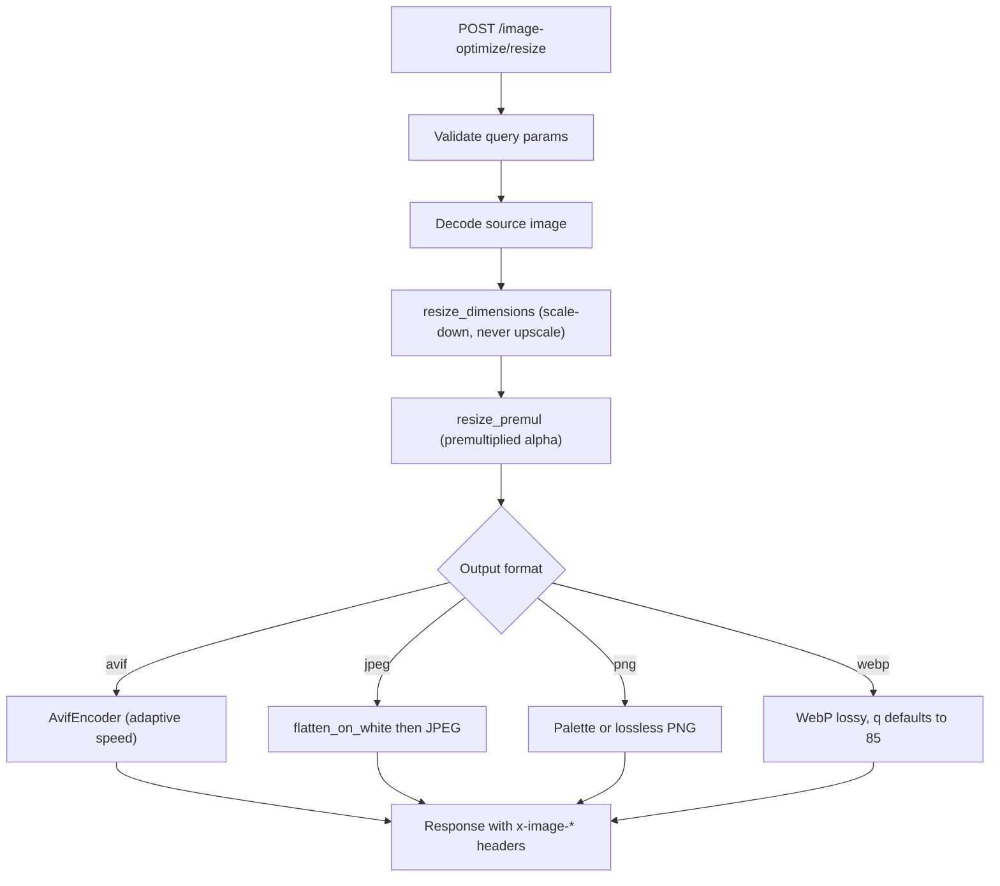
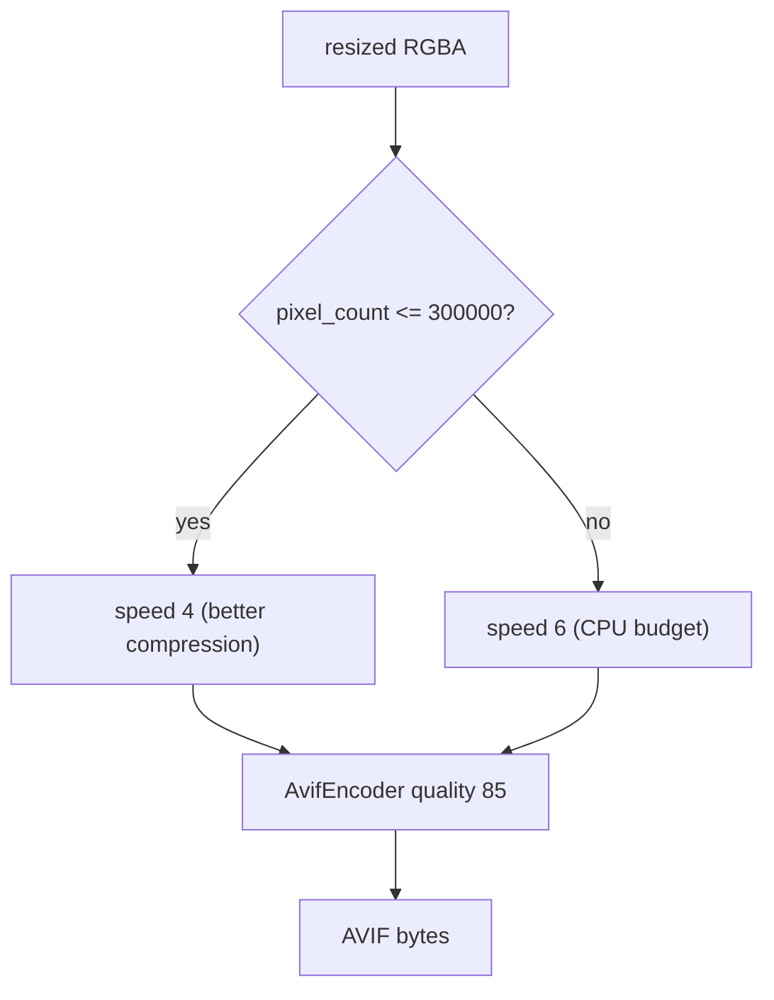
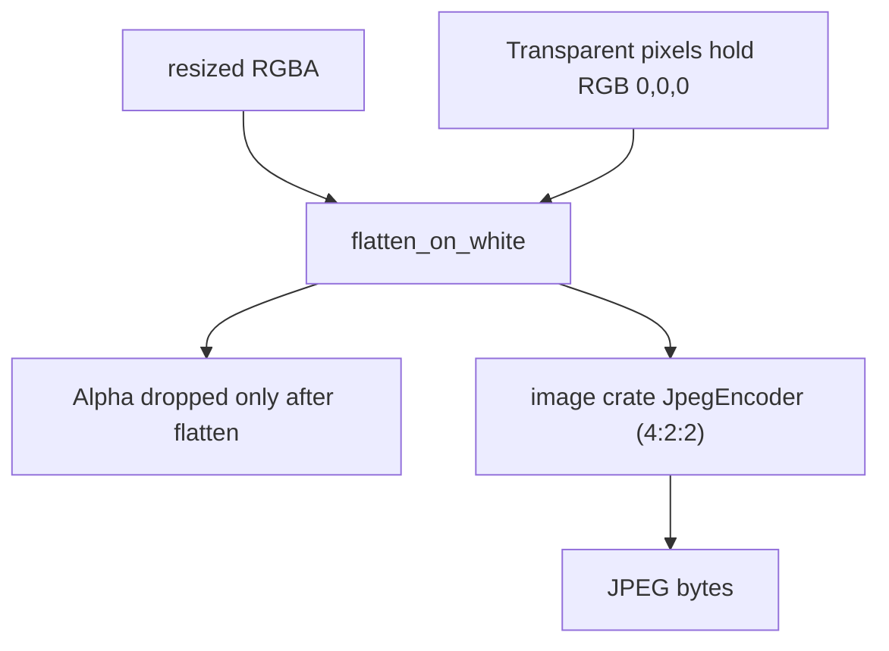
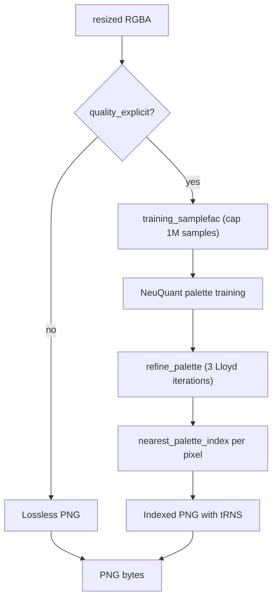
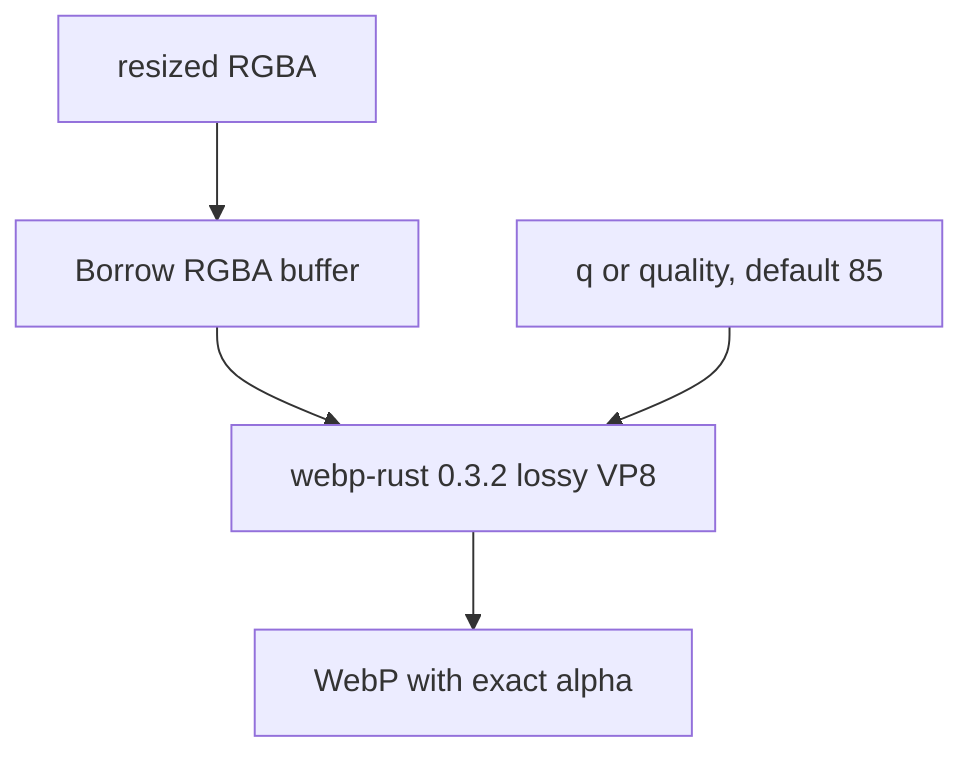

# Image Optimize Rust Algorithm

How `packages/image-optimize-rust` resizes and encodes images, and how
each format compares against the Cloudflare Images reference for the
same request parameters (`iphone-duo.png`, 1520x1080 RGBA, resized to
`w=100&h=100`, `fit=scale-down`). PSNR is computed on flatten-on-white
RGB unless noted as opaque (pixels with alpha >= 250 on both sides).

## Shared pipeline



The `image` crate's `resize()` interpolates all four channels uniformly,
which bleeds background RGB into visible pixels at the boundary between
content and transparency. `resize_premul` multiplies RGB by alpha before
interpolation and divides afterwards, so transparent pixels contribute
zero-weighted color. This cut gray semi-transparent pixels from 72.7% to
60.7% of the 894 boundary pixels. The residual grays are real edge
colors: Cloudflare's own output shows 149 strong gray pixels with
near-identical RGB (45,50,56) against ours (43,46,49).

## AVIF



Slower ravif speeds compress better but scale with pixel count:
measured 82.7 s at speed 4 for a 4K frame against 31.5 s at speed 6.
`avif_speed` therefore uses speed 4 only at or below 300,000 pixels
(the 512x512 preset and smaller, worst case ~2.6 s) and falls back to
speed 6 above. At 100x71 this yields 3100 bytes at 36.66 dB versus
lossless, against Cloudflare's 2951 bytes at 33.70 dB: +5% size at
higher fidelity. Quality stays at the lab default 85 because the slider
should map to visible fidelity and the size gap is closed by the speed
choice instead.

## JPEG



JPEG carries no alpha channel. Our transparent pixels hold RGB (0,0,0),
so letting the encoder drop alpha paints the background black and bleeds
a dark halo into semi-transparent edges. `flatten_on_white` composites
onto white first, matching Cloudflare (corners 255,255,255 against our
old 0,0,0).

At Cloudflare's size operating point (quality 75) we produce 2792 bytes
against their 2728 bytes while scoring 29.25 dB opaque against their
28.80 dB: within 2.4% of size and strictly better on fidelity. The lab
default (quality 85) reaches 31.65 dB at 3530 bytes.

The pure-Rust `jpeg-encoder` crate was evaluated as a replacement for
the image crate's hardcoded 4:2:2 subsampling (Cloudflare uses
libjpeg-turbo with 4:2:0) but its quality scale is far more aggressive:
quality 85 produced only 29.60 dB against the image crate's 33.93 dB,
and matching Cloudflare required quality 95 at 4693 bytes. The image
crate at a matched operating point already beats Cloudflare, so the
dependency was reverted.

## PNG



Three changes close the palette gap to Cloudflare:

1. `training_samplefac` caps NeuQuant training at one million samples.
   The old samplefac 10 sampled only every 10th pixel, starving the
   network on small outputs (710 samples for 226 colors at 100x71) and
   producing 27.69 dB. Full sampling lifts that to 30.96 dB, but costs
   4.7 s native at 4K against 436 ms at samplefac 10, so the cap
   bounds 4K outputs at samplefac 9 (~921,600 samples).
2. `refine_palette` runs three bounded Lloyd iterations over the
   trained palette, moving centroids to the local optimum NeuQuant's
   self-organizing map missed: 30.96 dB to 36.66 dB versus lossless.
3. Dithering was measured and rejected: Floyd-Steinberg dropped PSNR to
   34.64 dB and moved away from Cloudflare's own undithered output.

The combined result is 4737 bytes at 35.17 dB against Cloudflare's
4673 bytes at 36.58 dB: +1.4% size, within 1.4 dB of the lossless
ceiling. The regression floor is 33 dB, which fails if sampling reverts
to 10 or if the refinement pass is removed (both land at 30.96 dB).

## WebP



`webp-rust` is pinned to 0.3.2, whose published source includes the
[chroma rounding fix](https://github.com/mith-mmk/webp-rust/pull/1).
RGB is lossy, while alpha stays exact at `alpha_quality=100`. The
resize buffer is borrowed because the encoder makes its own RGBA copy.
For outputs above 300,000 pixels, alpha is stored uncompressed but exact.
This avoids a second lossless encoder with multiple full-frame buffers,
trading larger transparent outputs for bounded alpha working memory.

`f=webp` always produces lossy output, including when `q` is omitted.
`q` and its `quality` alias accept integers from 1 to 100, defaulting to
85. They control RGB fidelity and encoded size, not compression effort.
Quality 100 is still lossy. Lossless WebP is not exposed by this endpoint,
and `lossless` is rejected as an unsupported query parameter. Use PNG
without `q` when a pixel-exact output is required.

The response reports `x-image-encoding: lossy` and the actual requested
or default `x-image-quality`. The lab enables the quality slider for WebP,
sends `q`, and displays the response quality.

On the committed 100x71 iPhone fixture, q20 produces 2112 bytes at
21.21 dB opaque PSNR and q85 produces 3890 bytes at 28.57 dB opaque PSNR.
The previous lossless output was 10982 bytes. These results demonstrate
size and fidelity control, not libwebp or Cloudflare quality parity.
Encoded size need not increase monotonically for every image or q value.

## Cloudflare parity summary

References are committed under `tests/fixtures/cf/` and enforced by
tests.

| Format | CF bytes | CF vs lossless | Ours bytes | Ours vs lossless | Verdict |
|---|---|---|---|---|---|
| AVIF | 2951 | 33.70 dB | 3100 (speed 4) | 36.66 dB | +5% size, higher fidelity |
| JPEG | 2728 | 28.80 dB (opaque) | 2792 (q75) | 29.25 dB (opaque) | +2.4% size, beats CF |
| PNG | 4673 | 36.58 dB | 4737 | 36.66 dB | +1.4% size, at ceiling |
| WebP | 2904 | 31.11 dB | 3890 (q85) | 28.57 dB (opaque) | different quality scale and metric |

### Enforced thresholds

| Test | Threshold | Fails when |
|---|---|---|
| `jpeg_matches_cloudflare_at_matched_quality` | size <= CF x 1.15, opaque PSNR >= 28.8 | encoder or quality drifts |
| `avif_size_stays_close_to_cloudflare_reference` | size <= CF x 1.15 | speed rule regresses |
| `png_size_stays_close_to_cloudflare_reference` | size <= CF x 1.15 | palette path reverts to RGBA |
| `webp_preserves_saturated_colors` | RGB error <= 16, including odd and 1x1 dimensions | chroma desaturation returns |
| `webp_preserves_alpha_at_quality_extremes` | exact alpha at q1, q85, q100 | transparency changes |
| `webp_quality_controls_size_and_fidelity` | q85 >= 28 dB opaque, > q20 by 3 dB, smaller than lossless | q ignored or fidelity regresses |
| `palette_png_quality_stays_above_33db` | PSNR >= 33.0 dB | sampling or Lloyd refine removed |
| `jpeg_flattens_transparent_background_to_white` | corners > 240 | flatten removed, black halo returns |
| `resize_iphone_duo_to_100x100_avif` | dimensions, AVIF magic | resize or encoder breaks |
| `premul_preserves_color_at_opaque_transparent_boundary` | no gray fringe majority | premultiplied alpha removed |
| `training_samplefac_bounds_samples` | <= 1M samples at any size | CPU cap removed |
| `avif_speed_trades_cpu_for_small_outputs` | speed 4 <= 300K px else 6 | 4K encode regresses to 82.7 s |
| `refine_palette_reduces_quantization_error` | error strictly decreases | Lloyd refinement broken |
| `flatten_on_white_composites_transparency` | transparent becomes white | JPEG halo regression |

## Reproducing the measurements

```bash
cd packages/image-optimize-rust
cargo run --release --bin bench_neuquant
cargo test --target aarch64-apple-darwin
```

For the Worker and Chrome integration regression, first build this package
with `worker-build --release`, then start the frontend and gateway dev
servers. From the workspace root run `deno task test:image-optimize`.
It uses a fresh installed Chrome session and checks the actual Worker
response, browser-decoded saturated colors and alpha, query validation,
and the enabled slider submitting quality 40. Set
`WEBP_BROWSER_CHANNEL=chromium` to use Playwright Chromium in CI.
