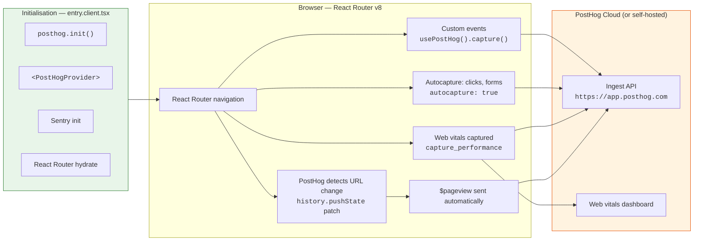
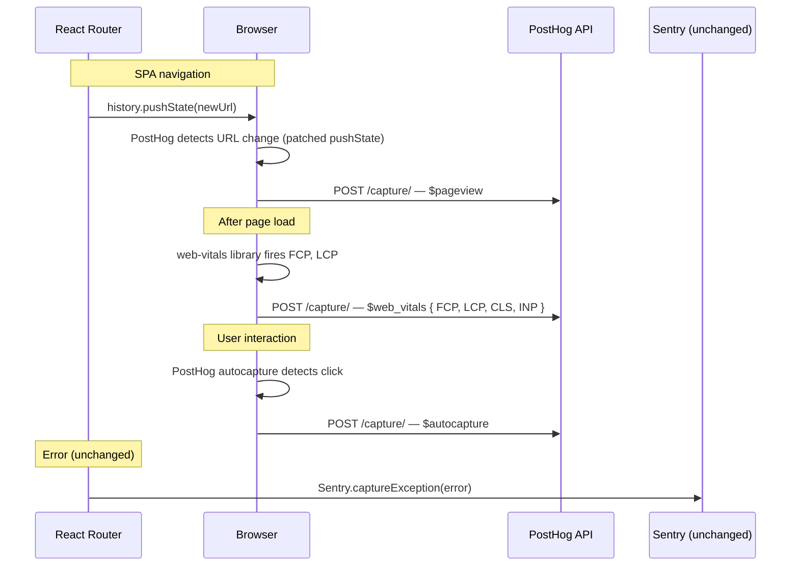

# PostHog Integration Guide (Browser — React Router v8)

This document is the source of truth for adding **PostHog product analytics** to this
project. It covers both client-side (browser) and server-side (Cloudflare Workers)
wiring using the `posthog-node` SDK designed for edge runtimes.

## What this guide covers

- Installing `posthog-js` and `@posthog/react`
- Initialising PostHog and adding the `PostHogProvider` context
- Automatic page view tracking via PostHog's default `capture_pageview`
- Automatic web vitals capture (FCP, LCP, INP, CLS) via `capture_performance`
- DOM autocapture for clicks and form submissions
- Using the `usePostHog()` hook in components
- Data-flow diagrams showing how PostHog fits alongside Sentry

## Prerequisites

Before you begin you need:

1. A PostHog project (Cloud at `https://app.posthog.com` or self-hosted).
2. The project's **API key** (project settings → Project API key) and **API host**
   (e.g. `https://app.posthog.com`).

## Architecture overview



The existing **Sentry** error-monitoring path is unchanged — PostHog handles
*product analytics* (page views), while Sentry continues to own *error monitoring,
tracing, and profiling*. They are complementary, not overlapping.

## Data flow (detailed)



## Installation

```sh
deno install npm:posthog-js@1.404.1 npm:@posthog/react@1.10.3
```

## Files to create / modify

| File | Action |
|---|---|
| `packages/frontend/app/entry.client.tsx` | **Edit** — init PostHog and wrap with `<PostHogProvider>` |
| `packages/frontend/app/utils/posthog.ts` | **Create** — PostHog client helper for Cloudflare Workers |
| `packages/frontend/worker.ts` | **Edit** — create PostHog client in fetch handler, capture + shutdown |
| `packages/frontend/app/types/vite-env.d.ts` | **Edit** — add `VITE_POSTHOG_TOKEN` and `VITE_POSTHOG_API_HOST` |
| `packages/frontend/wrangler.jsonc` | **Edit** — add `VITE_POSTHOG_TOKEN` and `VITE_POSTHOG_API_HOST` to all envs |

The official PostHog guide for React Router framework mode also recommends adding
`ssr.noExternal` in `vite.config.ts`:

```ts
// packages/frontend/vite.config.ts
ssr: {
  noExternal: ['posthog-js', '@posthog/react'],
},
```

**But** this project uses Cloudflare Workers where the client entry compiles
separately — you may not need it. Skip on first attempt; add if the build fails.

## Step-by-step implementation

### 1. Initialise PostHog in entry.client.tsx

Add the import and init call after Sentry initialisation, then wrap the hydration
tree with `PostHogProvider`:

```ts
// packages/frontend/app/entry.client.tsx

// — add these imports near the top —
import { PostHogProvider } from '@posthog/react';
import posthog from 'posthog-js';

// — add this block after the Sentry init (after line 106) —
posthog.init(import.meta.env['VITE_POSTHOG_TOKEN'] as string, {
  api_host: import.meta.env['VITE_POSTHOG_API_HOST'] as string,
  // Use 2026-05-30 defaults for modern behavior:
  // capture_pageview → 'history_change' (SPA auto-detection),
  // persistence_save_debounce_ms → 250, split_storage → true
  defaults: '2026-05-30',
  // Add tracing headers so server-side events link back to frontend sessions
  tracing_headers: [window.location.hostname, 'localhost'],
  // Enable autocapture of DOM interactions (clicks, form submissions, etc.)
  autocapture: true,
  // Enable web vitals autocapture (FCP, LCP, INP, CLS)
  capture_performance: true,
});

// — wrap the hydration block with PostHogProvider —
startTransition(() => {
  hydrateRoot(
    document,
    <StrictMode>
      <PostHogProvider client={posthog}>
        <BrowserBootstrapSpanEnder />
        <HydratedRouter
          instrumentations={[
            tracing.clientInstrumentation,
          ]}
          onError={sentryOnError}
        />
      </PostHogProvider>
    </StrictMode>
  );
});
```

### 2. Enable web vitals in PostHog project settings

In addition to the `capture_performance: true` config above, web vitals autocapture
must be toggled on in the PostHog UI:

1. Open **Settings → Project autocapture → Web vitals autocapture**
   (direct link: `https://app.posthog.com/settings/project-autocapture#web-vitals-autocapture`).
2. Click **Enable**.
3. Choose which metrics to capture (FCP, LCP, INP, CLS — all enabled by default).

Once enabled, PostHog sends `$web_vitals` events automatically. Metrics appear in
**Web Analytics → Web Vitals** dashboard and the raw event stream.

> Web vitals autocapture is separate from PostHog's regular autocapture (element
> clicks, form submissions). It works independently.

### 3. Update Content Security Policy

The official PostHog docs require these additions to your CSP (in
`packages/frontend/app/utils/csp.ts`):

```
script-src 'self' https://*.posthog.com;
connect-src 'self' https://*.posthog.com;
worker-src 'self' blob: data:;
```

- `script-src` — covers lazy-loaded PostHog bundles (autocapture recorder, surveys)
- `connect-src` — covers event ingestion and feature flag evaluation
- `worker-src` — covers session replay (if enabled later)

Without these, PostHog silently fails — `capture()` and `identify()` calls never
send, and the integration looks complete while zero events arrive.

These are already added to `packages/frontend/app/utils/csp.ts` in the
`defaultConnectSrc` and `defaultScriptSrc` arrays, and `worker-src` is in the
policy builder.

### 4. Add environment variables

**Local development:**

```bash
# packages/frontend/.dev.vars
VITE_POSTHOG_TOKEN=phc_your_project_api_key
VITE_POSTHOG_API_HOST=https://us.i.posthog.com
```

**Production** — set in the Cloudflare Worker environment:

| Variable | Where to set |
|---|---|
| `VITE_POSTHOG_TOKEN` | Wrangler `vars` in `packages/frontend/wrangler.jsonc` |
| `VITE_POSTHOG_API_HOST` | Wrangler `vars` in `packages/frontend/wrangler.jsonc` |

### 5. Add server-side PostHog to the Cloudflare Worker

The PostHog client is created in the actual Worker fetch handler (`worker.ts`), not
in React Router middleware. The [Cloudflare Workers PostHog docs](https://posthog.com/docs/libraries/cloudflare-workers)
recommend this pattern: create a client per request, capture with `captureImmediate()`,
and flush with `ctx.waitUntil(posthog.shutdown())` since Workers can terminate before
batched data is sent.

Create the helper at `packages/frontend/app/utils/posthog.ts`:

```ts
import { PostHog } from 'posthog-node';

export function createPostHogClient(env: {
  VITE_POSTHOG_API_HOST?: string;
  VITE_POSTHOG_TOKEN?: string;
}): PostHog | undefined {
  const token = env.VITE_POSTHOG_TOKEN;

  if (!token) {
    return undefined;
  }

  return new PostHog(token, {
    flushAt: 1,
    flushInterval: 0,
    host: env.VITE_POSTHOG_API_HOST ?? 'https://us.i.posthog.com',
  });
}
```

Then use it in `packages/frontend/worker.ts`:

```ts
// — add this import —
import { createPostHogClient } from './app/utils/posthog.ts';

// — inside the fetch handler (after getting requestUrl / requestStartedAt) —
const posthog = createPostHogClient(env);

if (posthog) {
  executionContext.waitUntil(posthog.captureImmediate({
    distinctId: 'server',
    event: 'worker_request',
    properties: {
      $current_url: request.url,
    },
  }));
  executionContext.waitUntil(posthog.shutdown());
}
```

Key details:

- `posthog-node` ships a `workerd` export that avoids Node.js built-ins — it
  works on Cloudflare Workers without requiring `nodejs_compat` for itself.
- `flushAt: 1` and `flushInterval: 0` send events immediately instead of batching,
  which is critical on Workers where the isolate can be terminated before
  a batched flush would fire.
- `ctx.waitUntil()` extends the Worker lifetime so the shutdown completes
  after the response is sent — events are not lost.
- A new PostHog client is created per request. Workers may reuse globals across
  requests on the same isolate, but the shutdown/flush lifecycle makes per-request
  instantiation safer.
- The client-side `tracing_headers` config attaches `X-POSTHOG-DISTINCT-ID` and
  `X-POSTHOG-SESSION-ID` headers to same-origin requests so SSR-captured events
  correlate with the correct frontend session.

## Usage patterns

### Access PostHog in a component

```tsx
import { usePostHog } from '@posthog/react';

function ReportButton(): JSX.Element {
  const posthog = usePostHog();

  return (
    <button onClick={() => posthog?.capture('report_generated', { type: 'pdf' })}>
      Generate report
    </button>
  );
}
```

### Identify user after login

```tsx
import { usePostHog } from '@posthog/react';

function LoginPage(): JSX.Element {
  const posthog = usePostHog();

  async function handleLogin(email: string, password: string) {
    const user = await login(email, password);

    posthog?.identify(user.id, {
      email: user.email,
      name: user.name,
    });
    posthog?.capture('user_logged_in');
  }

  // ...
}
```

PostHog automatically merges past anonymous events to this ID after identify.

### Capture exceptions in error boundary

```tsx
import { usePostHog } from '@posthog/react';

export function ErrorBoundary({ error }: Route.ErrorBoundaryProps): JSX.Element {
  const posthog = usePostHog();

  useEffect(() => {
    posthog?.captureException(error);
  }, [error, posthog]);

  // ... existing error UI
}
```

### Track element visibility

```tsx
import { PostHogCaptureOnViewed } from '@posthog/react';

<PostHogCaptureOnViewed name="pricing-section">
  <PricingTable />
</PostHogCaptureOnViewed>
```

## Verification checklist

- [ ] `deno task check` passes without errors.
- [ ] `deno task dev` starts without PostHog errors.
- [ ] A `$pageview` appears in PostHog on first load.
- [ ] Navigating between routes fires a new `$pageview` for each URL.
- [ ] Web vitals (`$web_vitals` events) appear after page load.
- [ ] A component using `usePostHog().capture()` sends custom events.

## Future work (not covered here)

| Item | When |
|---|---|
| Self-hosted PostHog deployment guide | When the team decides to self-host |

## Related docs

- [`sentry-setup.md`](./sentry-setup.md) — existing Sentry telemetry setup (PostHog is complementary)
- GitHub issue [#50](https://github.com/motss-app/test-hono-react-router-vite/issues/50) — tracking issue for the PostHog integration
- [PostHog React Router framework mode docs](https://posthog.com/docs/libraries/react-router/react-router-v7-framework-mode) — official reference
