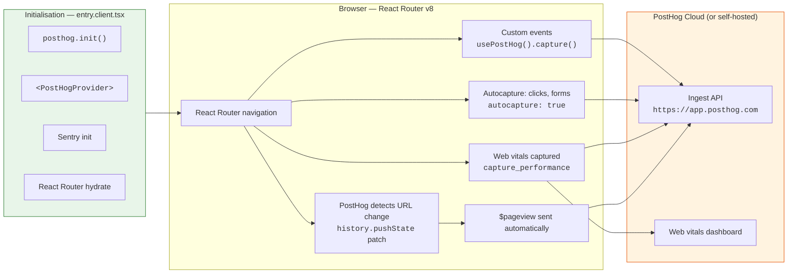
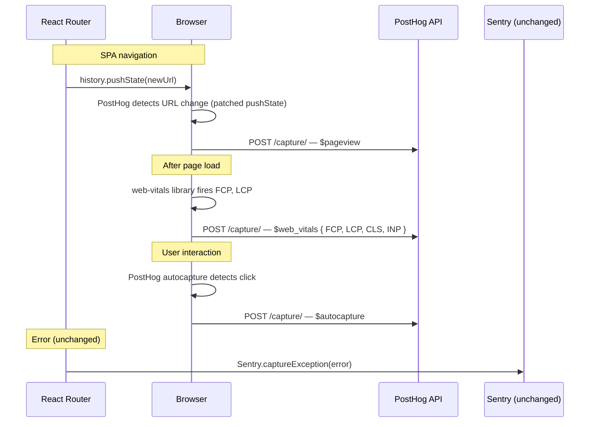

# PostHog Integration Guide (Browser — React Router v8)

This document is the source of truth for adding **PostHog product analytics** to the browser
side of this project's React Router v8 app. It covers the client-side wiring only —
server-side (Cloudflare Workers) event capture is future work.

## What this guide covers

- Installing `posthog-js` and `@posthog/react`
- Initialising PostHog and adding the `PostHogProvider` context
- Automatic page view tracking via PostHog's default `capture_pageview`
- Automatic web vitals capture (FCP, LCP, INP, CLS) via `capture_performance`
- DOM autocapture for clicks and form submissions
- Using the `usePostHog()` hook in components
- Data-flow diagrams showing how PostHog fits alongside Sentry

## Prerequisites

Before you begin you need:

1. A PostHog project (Cloud at `https://app.posthog.com` or self-hosted).
2. The project's **API key** (project settings → Project API key) and **API host**
   (e.g. `https://app.posthog.com`).

## Architecture overview



The existing **Sentry** error-monitoring path is unchanged — PostHog handles
*product analytics* (page views), while Sentry continues to own *error monitoring,
tracing, and profiling*. They are complementary, not overlapping.

## Data flow (detailed)



## Installation

```sh
deno install npm:posthog-js@1.230.0 npm:@posthog/react@1.1.0
```

## Files to create / modify

| File | Action |
|---|---|
| `packages/frontend/app/entry.client.tsx` | **Edit** — init PostHog and wrap with `<PostHogProvider>` |
| `packages/frontend/.dev.vars` | **Edit** — add `VITE_POSTHOG_API_KEY` and `VITE_POSTHOG_API_HOST` |

The official PostHog guide for React Router framework mode also recommends adding
`ssr.noExternal` in `vite.config.ts`:

```ts
// packages/frontend/vite.config.ts
ssr: {
  noExternal: ['posthog-js', '@posthog/react'],
},
```

**But** this project uses Cloudflare Workers where the client entry compiles
separately — you may not need it. Skip on first attempt; add if the build fails.

## Step-by-step implementation

### 1. Initialise PostHog in entry.client.tsx

Add the import and init call after Sentry initialisation, then wrap the hydration
tree with `PostHogProvider`:

```ts
// packages/frontend/app/entry.client.tsx

// — add these imports near the top —
import { PostHogProvider } from '@posthog/react';
import posthog from 'posthog-js';

// — add this block after the Sentry init (after line 106) —
posthog.init(import.meta.env.VITE_POSTHOG_API_KEY as string, {
  api_host: import.meta.env.VITE_POSTHOG_API_HOST as string,
  // Respect Do Not Track
  respect_dnt: true,
  // Persist the user identity across sessions
  persistence: 'localStorage',
  // Capture page views on navigation (auto-detects SPA route changes)
  capture_pageview: true,
  // Capture page leave events
  capture_pageleave: true,
  // Capture dead clicks (clicks on non-responsive elements)
  capture_dead_clicks: true,
  // Enable web vitals autocapture (FCP, LCP, INP, CLS).
  // Must also be enabled in PostHog project settings at:
  // Settings → Project autocapture → Web vitals autocapture
  capture_performance: true,
  // Enable autocapture of DOM interactions (clicks, form submissions, etc.).
  autocapture: true,
});

// — wrap the hydration block with PostHogProvider —
startTransition(() => {
  hydrateRoot(
    document,
    <StrictMode>
      <PostHogProvider client={posthog}>
        <BrowserBootstrapSpanEnder />
        <HydratedRouter
          instrumentations={[
            tracing.clientInstrumentation,
          ]}
          onError={sentryOnError}
        />
      </PostHogProvider>
    </StrictMode>
  );
});
```

### 2. Enable web vitals in PostHog project settings

In addition to the `capture_performance: true` config above, web vitals autocapture
must be toggled on in the PostHog UI:

1. Open **Settings → Project autocapture → Web vitals autocapture**
   (direct link: `https://app.posthog.com/settings/project-autocapture#web-vitals-autocapture`).
2. Click **Enable**.
3. Choose which metrics to capture (FCP, LCP, INP, CLS — all enabled by default).

Once enabled, PostHog sends `$web_vitals` events automatically. Metrics appear in
**Web Analytics → Web Vitals** dashboard and the raw event stream.

> Web vitals autocapture is separate from PostHog's regular autocapture (element
> clicks, form submissions). It works independently.

### 3. Add environment variables

**Local development:**

```bash
# packages/frontend/.dev.vars
VITE_POSTHOG_API_KEY=phc_your_project_api_key
VITE_POSTHOG_API_HOST=https://app.posthog.com
```

**Production** — set in the Cloudflare Worker environment:

| Variable | Where to set |
|---|---|
| `VITE_POSTHOG_API_KEY` | Wrangler `vars` in `packages/frontend/wrangler.jsonc` |
| `VITE_POSTHOG_API_HOST` | Wrangler `vars` in `packages/frontend/wrangler.jsonc` |

## Usage patterns

### Access PostHog in a component

```tsx
import { usePostHog } from '@posthog/react';

function ReportButton(): JSX.Element {
  const posthog = usePostHog();

  return (
    <button onClick={() => posthog?.capture('report_generated', { type: 'pdf' })}>
      Generate report
    </button>
  );
}
```

### Identify user after login

```tsx
import { usePostHog } from '@posthog/react';

function LoginPage(): JSX.Element {
  const posthog = usePostHog();

  async function handleLogin(email: string, password: string) {
    const user = await login(email, password);

    posthog?.identify(user.id, {
      email: user.email,
      name: user.name,
    });
    posthog?.capture('user_logged_in');
  }

  // ...
}
```

PostHog automatically merges past anonymous events to this ID after identify.

### Capture exceptions in error boundary

```tsx
import { usePostHog } from '@posthog/react';

export function ErrorBoundary({ error }: Route.ErrorBoundaryProps): JSX.Element {
  const posthog = usePostHog();

  useEffect(() => {
    posthog?.captureException(error);
  }, [error, posthog]);

  // ... existing error UI
}
```

### Track element visibility

```tsx
import { PostHogCaptureOnViewed } from '@posthog/react';

<PostHogCaptureOnViewed name="pricing-section">
  <PricingTable />
</PostHogCaptureOnViewed>
```

## Files to be aware of (existing stack)

| File | Why unchanged |
|---|---|
| `packages/frontend/app/entry.server.tsx` | PostHog tracking is browser-only in this phase |
| `packages/frontend/app/root.tsx` | No page view tracking needed — PostHog handles it automatically |
| `packages/frontend/app/utils/` | No analytics module needed — PostHog init lives in `entry.client.tsx` |
| `packages/frontend/worker.ts` | Server-side PostHog events are future work |
| `packages/bff/src/worker.ts` | Server-side PostHog events are future work |
| `packages/gateway/src/worker.ts` | No PostHog at the edge yet |
| All monitoring/sentry files | PostHog and Sentry are independent |

## Verification checklist

- [ ] `deno task check` passes without errors.
- [ ] `deno task dev` starts without PostHog errors.
- [ ] A `$pageview` appears in PostHog on first load.
- [ ] Navigating between routes fires a new `$pageview` for each URL.
- [ ] Web vitals (`$web_vitals` events) appear after page load.
- [ ] A component using `usePostHog().capture()` sends custom events.

## Future work (not covered here)

| Item | When |
|---|---|
| Server-side event capture in the BFF (`packages/bff/src/worker.ts`) | When server events need PostHog |
| Self-hosted PostHog deployment guide | When the team decides to self-host |

## Related docs

- [`sentry-setup.md`](./sentry-setup.md) — existing Sentry telemetry setup (PostHog is complementary)
- GitHub issue [#50](https://github.com/motss-app/test-hono-react-router-vite/issues/50) — tracking issue for the PostHog integration
- [PostHog React Router framework mode docs](https://posthog.com/docs/libraries/react-router/react-router-v7-framework-mode) — official reference
